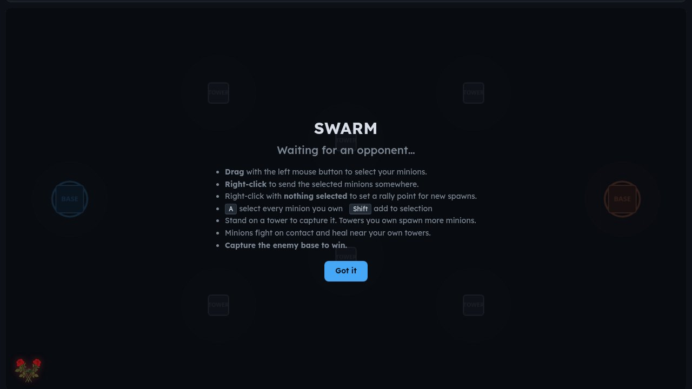

# Carmine: Swarm Command, the two-player prototype for Merlot

*Why Carmine? Carmine dye is made from swarms of cochineal insects.*

Carmine was the prototype for [Merlot](https://veered.org/merlot/): the swarm battle it started as grew into Merlot's team strategy game.

**Play it now: [swarm.veered.org](https://swarm.veered.org)** · more games at [veered.org](https://veered.org)



Swarm is a free two-player real-time strategy game that runs in the browser. Each
side starts with a base and a stream of minions. Drag-select your minions, send them
at the towers, and capture your opponent's base. Nothing to install, no account needed:
share the link and play.

## Please test before relying on it

This is shared as-is, with no warranty. It works on my own computers, but your system,
settings and software versions may differ, so please try it in a safe setting first.
If something doesn't work, you can ask Claude (or another AI coding assistant) to look
into it, and I'd appreciate hearing what you found and how you fixed it. You are also
welcome to just let me know at support@veered.org, and I'll look into it.

## How it works

- **Server:** a Cloudflare Worker with Durable Objects (`src/`). One `Room` Durable
  Object holds the players' WebSockets and runs the 20 Hz simulation tick
  (`src/game.js`). The tick stops when the room empties so the object can be evicted.
- **Client:** a single self-contained page (`public/index.html`). Sound effects are
  synthesised with the Web Audio API, so there are no audio assets.
- **Stats:** a `Stats` Durable Object keeps one row per finished match, readable at
  `/api/stats?key=STATS_KEY&days=N`.

## Run it yourself

Requires Node.js 22 or later.

```bash
npm install
cp .dev.vars.example .dev.vars   # optional
npx wrangler dev                 # then open http://localhost:8787 in two tabs
```

To deploy to your own Cloudflare account, run `npx wrangler deploy`. To serve it on
your own hostname, uncomment the `[[routes]]` block in `wrangler.toml`. The optional
`STATS_KEY` is set in production with `npx wrangler secret put STATS_KEY`.

## Credits and licenses

- Code: MIT. See [LICENSE](LICENSE).
- No third-party art, fonts or sound files are included. Sounds are generated in the browser.
- The gameplay is inspired by classic Flash-era browser strategy games. Swarm is not
  affiliated with or endorsed by any of their publishers.
- Swarm was written with AI assistance (Claude).
